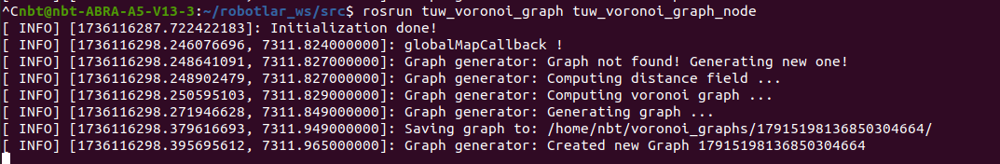

# TurtleBot3 Maze Patrol

This project aims to enable the TurtleBot3 robot to navigate the most inclusive area on a map using a **Voronoi Diagram** based graph and perform a patrol task. The robot utilizes the voronoi diagram approach and motion planning algorithms to effectively cover the entire map.

---

## Project Goal

This project presents a solution for a robot to perform a patrol task in a mapped environment using a **Voronoi Diagram**. The robot visits nodes in the generated graph to access the entire map. Performance metrics such as the total distance traveled and the percentage of the area covered by the robot during the entire mission are calculated. 

For this purpose:
1. **Voronoi diagram** and graph are created.
2. The **graph is traversed in a logical way for the robot to reach the goal**.
3. Covered area and performance metrics are visualized.

---

## Installation and Requirements

### 2. TUW Multi Robot Package Setup
(https://github.com/tuw-robotics/tuw_multi_robot)

Follow the steps below to install the `tuw_multi_robot` package, which is required to build graphs with the Voronoi diagram: 
```bash
sudo apt install libdxflib-dev
export ROS_VERSION=noetic   # for Ubuntu 20.04
sudo apt install ros-$ROS_VERSION-map-server
sudo apt install ros-$ROS_VERSION-stage-ros
export MRRP_DIR=$HOME/projects/catkin/tuw_multi_robot/
mkdir -p $MRRP_DIR/src
cd $MRRP_DIR/src
git clone --branch $ROS_VERSION git@github.com:tuw-robotics/tuw_multi_robot.git 
git clone --branch $ROS_VERSION git@github.com:tuw-robotics/tuw_geometry.git 
git clone git@github.com:tuw-robotics/tuw_msgs.git 
```

If you get errors during compilation, install the master branch of tuw_multi_robot.

### 3. Adding a Custom Voronoi Node

Replace the voronoi_graph_node.cpp file in the tuw_multi_robot package with the new voronoi_graph_node.cpp file provided in the project:
```
cd ~/robotlar_ws/src/tuw_multi_robot/tuw_voronoi_graph/src
cp /path/to/custom_voronoi_graph_node.cpp voronoi_graph_node.cpp
cd ~/robotlar_ws
catkin_make
source devel/setup.bash
```
Modifications have been made according to the micromousemaze environment:
```
void VoronoiGeneratorNode::publishSegments()
{
graph.origin.position.x = -10.0; // For SOLVE MAZE make this -10
graph.origin.position.y = -10.0; // For SOLVE MAZE make this -10

pos.x = path[i][0] * resolution_ + graph.origin.position.x; // origins added
pos.y = path[i][1] * resolution_ + graph.origin.position.y; // origins added

```

### 4. Running the Project
**Simulation and Mapping**

Start the simulation and map by running the following steps in the terminal:
##### Step 1: Start the maze
```
roslaunch micromouse_maze micromouse_maze4.launch
```
##### Step 2: Start the map server
```
rosrun map_server map_server $(rospack find micromouse_maze)/maps/map.yaml
```
### 5. TurtleBot3 Navigation
##### Step 3: AMCL (Adaptive Monte Carlo Localization)
```
roslaunch turtlebot3_navigation amcl.launch
```
##### Step 4: Move Base
Green path move base :
```
roslaunch turtlebot3_navigation move_base.launch
```
<p>

</p>

### 6. Voronoi 
##### Step 5: Create Voronoi Diagram
This script takes a map (OccupancyGrid) as input and creates a Voronoi graph on top of it. The Voronoi graph represents the optimal paths through the free spaces on the map as a network structure. The generated graph can be published on ROS topics and can be used with other systems. This is especially useful for patrolling. 

To look at the published segments:
```
rostopic echo /segments
```
To run it:
```
rosrun tuw_voronoi_graph tuw_voronoi_graph_node
```
<p>

</p>

Map:
<p>

</p>

##### Step 6: Visualization of Segments

With the voronoi_segments node, the segments of the voronoi diagram are visualized by listening on the rviz to the marker type message published via the voronoi_segments_marker topical.
```
rosrun turtlebot3_devriye voronoi_segments
```
<p>

</p>

#### 7th Patrol Mission
##### Step 7: Run the patrol node
```
rosrun turtlebot3_devriye devriye
```
- Patrol Video:
<p>

</p>
- Patrol sequence and completion of the patrol:
<p>

</p>

<p>

</p>

